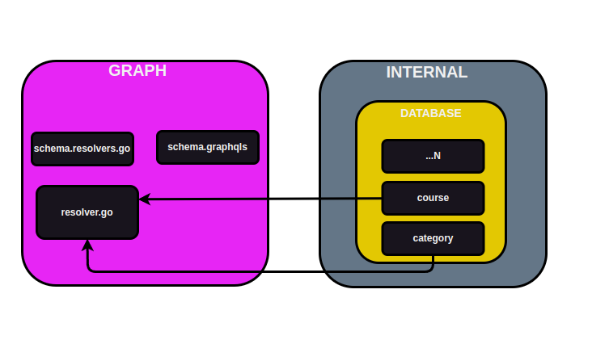

# GraphQL

## Download dependencies

- go mod tidy

## Gerando novos modelos

 -  Para gerar um novo modelo com base em um novo schema ou um schema atualizado

```view
  - go run github.com/99designs/gqlgen generate
```
 - Dentro do schema.resolvers.go existem codigos que foram alterados ou que não existem mais dentro do shcema graphql

## Como fazer chamadas GraphQL através do Front ou Platground

```bash

  Input de busca:

  query queryCategories {
    categories {
      id
      name
      description
    }
  }

  Output dos erros:
  {
  "errors": [
    {
      "message": "internal system error",
      "path": [
        "categories"
      ]
    }
  ],
  "data": null
}

```

## Como injectar sua conexão com o banco de dados dentro de um schema.resovler ?

```view

  Dentro do schema.resolvers existe dois arquivos:
    - type mutationResolver struct{ *Resolver }
    - type queryResolver struct{ *Resolver }
  Se pegarmos a ideia de OO eles estão fazendo um "extends" de Resolver.
  Nesse caso nossa instanciação de category.go será dentro de resolver.go (graph/resolver.go)

  Agora, com nossa category.go injetada em schema.resolvers podemos acessar o CreateCategory que está dentro de internal/database/category dentro do schema.resolvers.go

```



## Persistindo categoria pelo playground GraphQL

```view

  mutation createCategory {
    createCategory(input: { name: "Tec", description: "Cursos"}) {
      id
      name
      description
    }
  }

```

## Listando categorias pelo playground GraphQL

```view

  query queryCategories {
    categories {
      id
      name
      description
    }
  }

  query queryCategoriesX {
    categories {
      id
    }
  }

```

## Alterando o model do GraphQL

```view

  Existe a possibilidade de alterar o arquivo default do graph/model/models_gen.go.

  Para realizar essa alteração será necessário entrar dentro do gqlgen.yml ir até o final do arquivo na parte de `models:` e Criar um novo apontamento para a nova struct que foi criada.


  Ex gqlgen.ymnl:

    models:
      Category:
        model:
        - github.com/rafaelcarvalhocaetano/gqlgen/graph/model.Category
      Course:
        model:
        - github.com/rafaelcarvalhocaetano/gqlgen/graph/model.Course
      ID:
        model:
          - github.com/99designs/gqlgen/graphql.ID
          - github.com/99designs/gqlgen/graphql.Int
          - github.com/99designs/gqlgen/graphql.Int64
          - github.com/99designs/gqlgen/graphql.Int32
      Int:
        model:
          - github.com/99designs/gqlgen/graphql.Int
          - github.com/99designs/gqlgen/graphql.Int64
          - github.com/99designs/gqlgen/graphql.Int32


```
